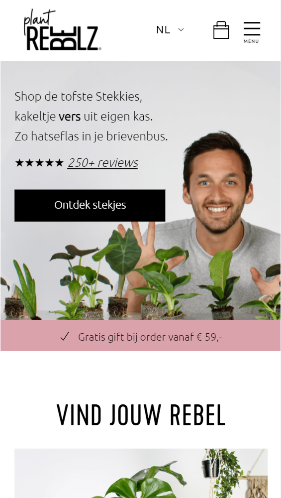
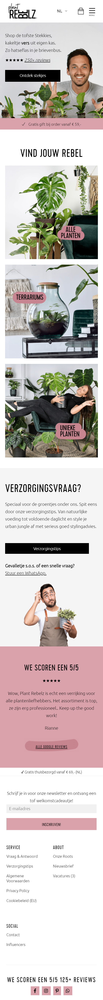
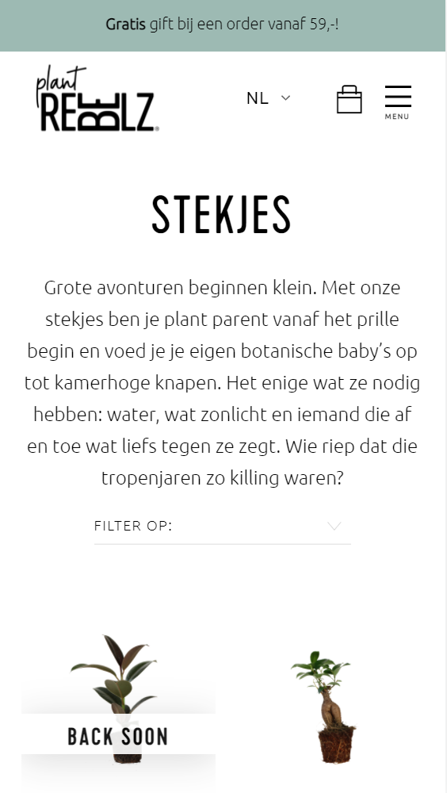
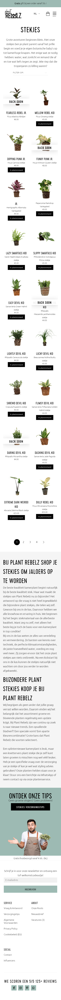
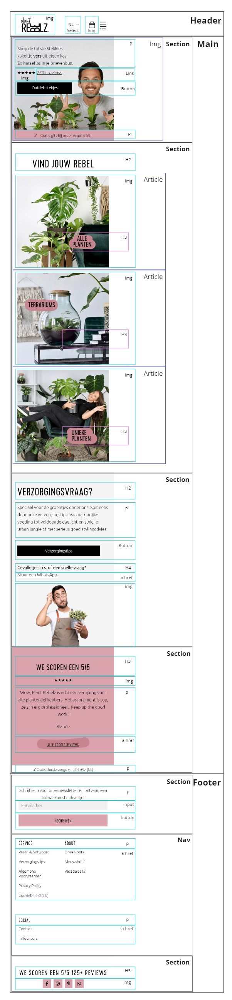
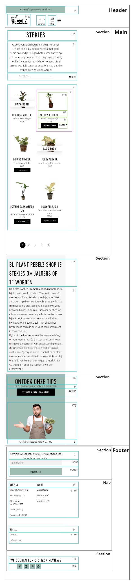
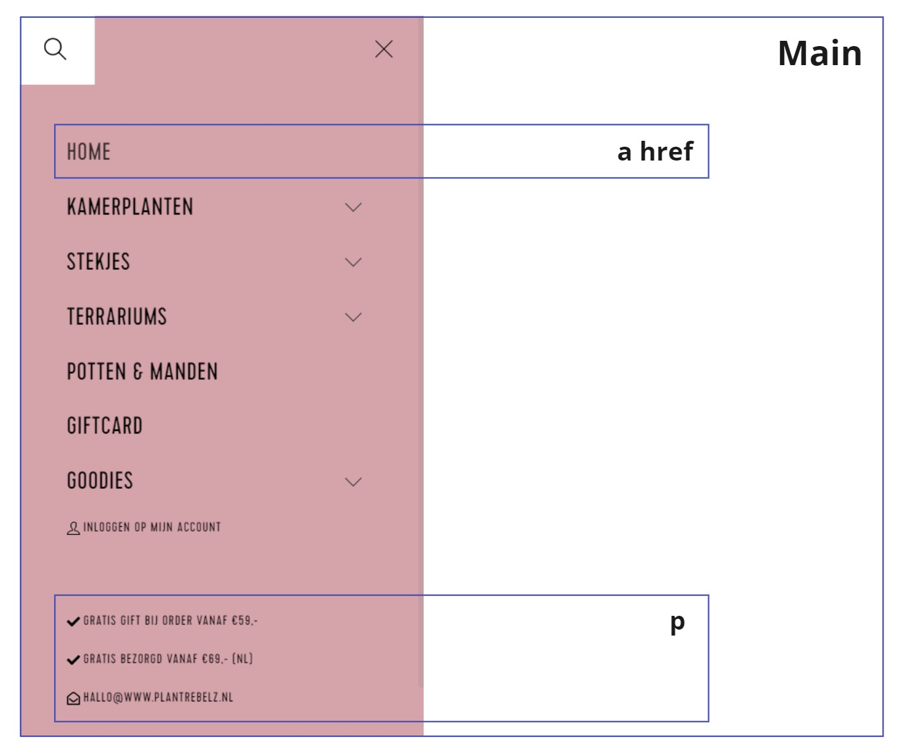
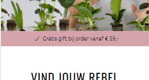
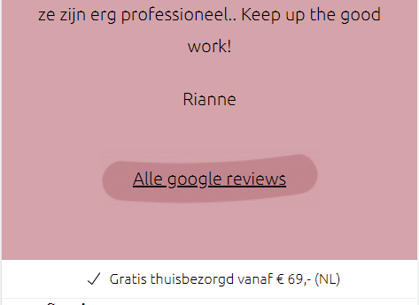
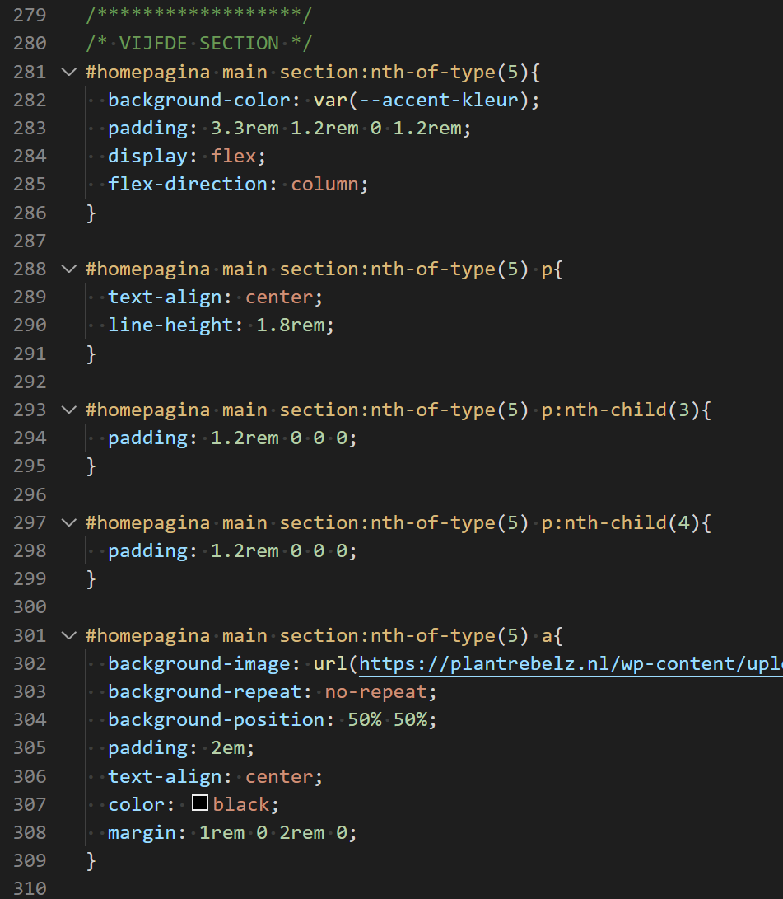

# Procesverslag
Markdown is een simpele manier om HTML te schrijven.  
Markdown cheat cheet: [Hulp bij het schrijven van Markdown](https://github.com/adam-p/markdown-here/wiki/Markdown-Cheatsheet).

Nb. De standaardstructuur en de spartaanse opmaak van de README.md zijn helemaal prima. Het gaat om de inhoud van je procesverslag. Besteedt de tijd voor pracht en praal aan je website.

Nb. Door *open* toe te voegen aan een *details* element kun je deze standaard open zetten. Fijn om dat steeds voor de relevante stuk(ken) te doen.

## Jij

uitwerken voor kick-off werkgroep

### Auteur:
Pip Harsveld

#### Je startniveau:
Rood

#### Je focus:
Surface Plane

## Je website

uitwerken voor kick-off werkgroep

### Je opdracht:
link naar de website die ik ga maken:
(https://www.plantrebelz.nl/)

#### Screenshot(s) van de eerste pagina (small screen): 
Home | Plant Rebelz  
Viewport:  
  
Hele homepage onder elkaar:  

#### Screenshot(s) van de tweede pagina (small screen):
Stekjes kopen | Plant Rebelz  
Viewport:  
  
Hele homepage onder elkaar:  

 

## Breakdownschets (week 1)

uitwerken na afloop 2e werkgroep

### de homepagina: 

### de overzichtspagina: 

### een dynamisch deel (menu): 

## Voortgang 1 (week 2)

uitwerken voor 1e voortgang

### Stand van zaken
Het coderen is deze week vrij goed gegaan. Ik ben niet tegen al te grote problemen  
gelopen en de eerste pagina begint nu echt al te lijken op de site van Plant Rebelz!  
Wel had ik wat problemen om de content in de roze balk (zie screenshot) zowel  
horizontaal als verticaal te centreren, maar met wat hulp is dat nu wel gelukt :)  

### Verslag van meeting
hier na afloop snel de uitkomsten van de meeting vastleggen

- Probeer overal dezelfe waardes te gebruiken (px,em,%,vh,vw etc worden nu allemaal gebruikt)
- Kijk of het lukt om SVG's in te laden i.p.v. image tag
- Als je voor elke pagina één id gebruikt, is het makkelijker te stylen
- Andere tag gebruiken voor het euro-tekens
- Er bestaan speciale tags voor reviews

## Voortgang 2 (week 3)

uitwerken voor 2e voortgang

### Stand van zaken
Ik ben deze week weer gestaag verder gegaan met het coderen. De eerste pagina is bijna  
af en ik ben van plan om dit weekend te beginnen met het stylen van de tweede pagina.  
Ik had nog wel wat moeite met de achtergrondafbeelding bij de link naar de google  
reviews (zie afbeelding). In de les heb ik hier vragen over gesteld en nu is het gelukt.  
Ook had ik wat ruzie met de line-height property. Ik had hem op de verkeerde manier  
gebruikt waardoor alle elementen, en dus ook een afbeelding, een line-height kregen.
  

### Verslag van meeting
hier na afloop snel de uitkomsten van de meeting vastleggen

- Naam nog invullen in de "head"
- Afbeelding en button in de vierde section centreren met flexbox en align items
- Plaats nog dubbele quotes (" ") om de id heen. Zelfde geldt voor de url in css

## Toegankelijkheidstest (week 4)

uitwerken na test in 8e voortgang

### Bevindingen
Lijst met je bevindingen die in de test naar voren kwamen:

#### Hamburgermenu werkt niet helemaal lekker
Je kan niet met de tab-toets door het menu gaan. Wel kan je het menu openen en sluiten,  
maar je kan niet de menu items selecteren.  

Oplossing: geen img gebruiken voor het hamburgermenu, maar dmv linear gradient de drie  
streepjes met code "tekenen". Ook ga ik ipv werken met transform: translate(100%) werken  
met transform: scale(0). Ik hoop dat ik op die manier dit kan oplossen.

#### "Voer engels in"
Op mijn tweede pagina (stekjes.html) zegt de screenreader voor vrijwel elk element "voer  
engels in".  

Oplossing: "HTML lang=" veranderen van eng naar nl.

#### Winkelmandje selecteren met tab
Het is niet mogelijk om met de tab-toets naar het winkelmandjeicoon te navigeren en hem  
vervolgens te selecteren.  

Oplossing: De image verpakken in een link (a) element.

#### Social media icons selecteren met tab
Het is niet mogelijk om met de tab-toets naar de socialmediaicons te navigeren en ze  
vervolgens te selecteren.  

Oplossing: De images verpakken in een link (a) element.

#### Borders bij focus niet zichtbaar 
Ik heb bij de focus state de elementen een zwarte border gegeven, maar ik heb ook zwarte  
buttons op mijn website staan. Bij deze zwarte buttons is de zwarte lijn dus niet goed  
zichtbaar.

Oplossing: De zwarte buttons een andere kleur border geven bij de focus state.

## Voortgang 3 (week 4)

uitwerken voor 3e voortgang

### Stand van zaken
Deze week was de eerste keer sinds het programmeren van deze site dat ik op het punt  
stond om mijn laptop uit het raam te gooien. Ik was een paar dingen aan het schuiven  
in mijn HTML (containers weggehaald en andere weer toegevoegd), waardoor mijn hamburgermeu
het ineens niet meer deed. Ik heb een hele dag van alles geprobeerd maar niets leek  
te werken. Uiteindelijk heb ik het in het FED kanaal gevraagd en toen kwam de conclusie  
dat het te maken had met hoe specifiek de elementen zijn en in welke volgorde ze staan.  
Ik dacht dat het aan mijn java script lag, maar de fout bleek dus bij mijn css te liggen.  
Ondanks dat ben ik deze week erg lekker verder gegaan met mijn website. Beide pagina's  
zijn af en ik heb ook al wat aandacht besteed aan het keuzeonderdeel. 

### Verslag van meeting
hier na afloop snel de uitkomsten van de meeting vastleggen

- De bovenste blauwe balk op stekjespagina fixen met flex-grow: 1 en width: 100%
- Reviewslider: de padding van de container (div) verwijderen en padding zetten op de reviews (articles) zelf zetten.

## Eindgesprek (week 5)

uitwerken voor eindgesprek

### Stand van zaken
Meteen na het feedbackgesprek ging ik de puntjes verbeteren en liep ik tegen twee nieuwe  
problemen aan. Door display flex op de reviews kwamen ze naast elkaar te staan en kon je  
dus de website uitzoomen. Ik had het proberen op te lossen met overflow: hidden maar het  
leek niet te werken. Achteraf bleek dat ik de overflow op een verkeerd element had gezet.  
Het tweede probleem was een stuk ingewikkelder. Als ik mijn hamburgermenu opende, waren  
de reviews nog zichtbaar, omdat ze er als het ware overheen lagen. Met hulp van Robbert  
is het uiteindelijk gelukt om het op te lossen. Door de transform werd er een nieuwe stacking 
context gemaakt, die overschreven kon worden door position: relative op de section zelf 
 en z-index: -1.

### Screenshot(s)

hier screenshot(s) van je eindresultaat

## Bronnenlijst

continu bijhouden terwijl je werkt

1. Iconen die gebruikt worden op de site van Plant Rebelz: https://themify.me/themify-icons
2. Uitleg over rel="noopener": https://www.wplounge.nl/rel-noopener-links-wordpress/
3. Uitleg over SVG inladen: https://css-tricks.com/using-svg/
4. Specificity Calculator: https://specificity.keegan.st/
5. Tips van Sanne hoe ik mijn hamburgermenu beter kan maken: https://codepen.io/shooft/pen/YzQBKwe
6. Code van Robbert voor een tekstslider: https://codepen.io/robertspier/pen/YzQgGbZ?editors=1100
7. Uitleg over z-index stacking contexts: https://stackoverflow.com/questions/20851452/z-index-is-canceled-by-setting-transformrotate
8. Info twee headers: https://stackoverflow.com/questions/4837269/html5-using-header-or-footer-tag-twice#:~:text=Yes%20you%20can%20use%20multiple,but%20this%20is%20not%20required.
9. Naslag animaties: https://www.w3schools.com/css/css3_animations.asp
10. Uitleg darkmode: https://stuffandnonsense.co.uk/blog/redesigning-your-product-and-website-for-dark-mode

